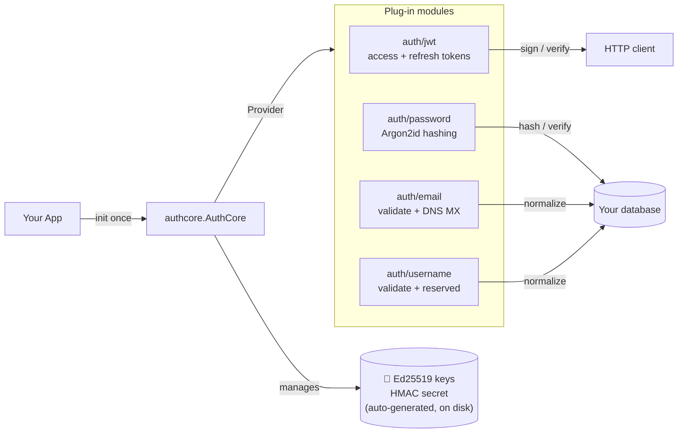

<h1 align="center">🛡️ authcore</h1>

<p align="center">
  <b>Drop-in authentication for Go. Password hashing, JWT sessions, email + username validation — secure defaults, zero boilerplate.</b>
</p>

<p align="center">
  <a href="https://pkg.go.dev/github.com/Jaro-c/authcore"></a>
  <a href="https://goreportcard.com/report/github.com/Jaro-c/authcore"></a>
  <a href="https://opensource.org/licenses/MIT"></a>
  <a href="https://github.com/Jaro-c/authcore/actions/workflows/ci.yml"></a>
  <a href="https://codecov.io/gh/Jaro-c/authcore"></a>
  <a href="https://github.com/Jaro-c/authcore/actions/workflows/codeql.yml"></a>
  <a href="https://scorecard.dev/viewer/?uri=github.com/Jaro-c/authcore"></a>
  <a href="https://github.com/sponsors/Jaro-c"></a>
</p>

<p align="center">
  <a href="#quick-start">Quick Start</a> ·
  <a href="#why-authcore">Why AuthCore?</a> ·
  <a href="#modules-at-a-glance">Modules</a> ·
  <a href="examples/">Examples</a> ·
  <a href="https://pkg.go.dev/github.com/Jaro-c/authcore">API Docs</a>
</p>

---

## What is AuthCore?

AuthCore is a Go library that handles the authentication plumbing most apps need — **password hashing, login tokens, refresh/rotation, email + username validation** — without forcing you to become a crypto expert. Import it, call three functions, and you have login that a security auditor would accept.

Written for **Go 1.26+**. No database. No HTTP framework. You plug those in.

```bash
go get github.com/Jaro-c/authcore
```

## How it fits together



Pick only the modules you need. Each one is independent, testable, and safe by default.

---

## Table of Contents

- [Why AuthCore?](#why-authcore)
- [Modules at a Glance](#modules-at-a-glance)
- [Features](#features)
- [Quick Start](#quick-start)
- [JWT Authentication](#jwt-authentication)
- [Password Hashing](#password-hashing)
- [Email Validation](#email-validation)
- [Username Validation](#username-validation)
- [Key Management](#key-management)
- [Configuration](#configuration)
- [Custom Logger](#custom-logger)
- [Testing Your Auth Layer](#testing-your-auth-layer)
- [Migrating from bcrypt / other libraries](#migrating-from-bcrypt--other-libraries)
- [Project Layout](#project-layout)
- [Writing a Module](#writing-a-module)
- [Error Handling](#error-handling)
- [FAQ](#faq)
- [Roadmap](#roadmap)
- [Contributing](#contributing)
- [Security](#security)
- [License](#license)

---

## Why AuthCore?

You could roll your own — but password storage, token signing, and timing-safe comparison are the kind of things you only get wrong once. You could also pull in a full identity platform — but that's a lot of surface area for a login form.

AuthCore sits in the middle: **a small, opinionated library that does the dangerous parts for you** and leaves the rest to your app.

| | Roll your own | Full IdP (Ory, Keycloak) | **AuthCore** |
|---|:---:|:---:|:---:|
| Time to first login | Hours – days | Hours (with ops) | **5 minutes** |
| Database included | ❌ (you build it) | ✅ (theirs) | ❌ (**bring your own — any DB works**) |
| HTTP server included | ❌ | ✅ (theirs) | ❌ (**plug into any router**) |
| Argon2id password hashing | Manual | ✅ | ✅ |
| EdDSA access + refresh tokens | Manual | ✅ | ✅ |
| Timing-safe comparisons | Easy to forget | ✅ | ✅ |
| Automatic key management | Manual | ✅ | ✅ |
| OAuth / OIDC provider | ❌ | ✅ | Planned |
| You own the data model | ✅ | ❌ | ✅ |
| Runs in-process, no extra service | ✅ | ❌ | ✅ |

Use AuthCore when you want **security defaults without the infrastructure cost** of a dedicated identity platform.

---

## Modules at a Glance

| Module | Does | Import |
|---|---|---|
| 🔐 **`auth/jwt`** | Sign + verify access/refresh tokens. EdDSA / Ed25519. Generic custom claims. Rotation. | `github.com/Jaro-c/authcore/auth/jwt` |
| 🔑 **`auth/password`** | Hash + verify passwords. Argon2id. Policy enforced. PHC format (self-describing). | `github.com/Jaro-c/authcore/auth/password` |
| 📧 **`auth/email`** | Validate + normalize addresses. RFC 5321/5322. Optional DNS MX check (cached). | `github.com/Jaro-c/authcore/auth/email` |
| 👤 **`auth/username`** | Validate + normalize usernames. Reserved-name blocklist. Character rules. | `github.com/Jaro-c/authcore/auth/username` |

Each module works on its own — mix and match.

---

## Features

- **EdDSA / Ed25519 token signing** — fast, constant-time, no padding-oracle risk
- **Dual-token model** — short-lived access tokens + long-lived refresh tokens
- **Argon2id password hashing** — memory-hard, GPU/ASIC-resistant, PHC format
- **Email validation & normalization** — RFC 5321/5322 compliance, optional DNS MX verification with cache
- **Username validation & normalization** — character rules, consecutive-special detection, fixed reserved name blocklist
- **Automatic key management** — generates, persists, and loads keys on first run
- **Generic custom claims** — embed any struct in access tokens with full type safety
- **Timing-safe comparisons** — `subtle.ConstantTimeCompare` throughout
- **Clock skew tolerance** — configurable leeway for distributed deployments
- **Pluggable logger** — bring slog, zap, zerolog, or any custom backend
- **Testable by design** — injectable clock and `Provider` interface for unit tests
- **Minimal dependencies** — `golang-jwt/jwt/v5`, `golang.org/x/crypto`, `golang.org/x/sync`

---

## Quick Start

```go
package main

import (
    "log"

    "github.com/Jaro-c/authcore"
    "github.com/Jaro-c/authcore/auth/jwt"
    "github.com/Jaro-c/authcore/auth/password"
)

type UserClaims struct {
    Name string `json:"name"`
    Role string `json:"role"`
}

func main() {
    // 1. One-time setup at startup.
    //    On first run, Ed25519 keys + HMAC secret are generated in ./.authcore/.
    auth, err := authcore.New(authcore.DefaultConfig())
    if err != nil {
        log.Fatal(err)
    }

    // 2. Password hashing — zero config, OWASP-recommended Argon2id defaults.
    pwdMod, err := password.New(auth)
    if err != nil {
        log.Fatal(err)
    }

    // 3. JWT tokens — set issuer + audience to your service URL in production.
    jwtMod, err := jwt.New[UserClaims](auth, jwt.DefaultConfig())
    if err != nil {
        log.Fatal(err)
    }

    // Registration: hash the plaintext, store only the hash.
    hash, err := pwdMod.Hash("Str0ng-P@ssword!")
    if err != nil {
        log.Fatal(err) // e.g. password.ErrWeakPassword — surface the reason to the user
    }
    // → db.StorePasswordHash(userID, hash)

    // Login: verify the submitted password, then issue a token pair.
    ok, err := pwdMod.Verify("Str0ng-P@ssword!", hash)
    if err != nil || !ok {
        log.Fatal("wrong password")
    }

    // userID must be a UUID v7 — the rest of your app can generate this.
    userID := "019600ab-1234-7000-8000-000000000001"
    pair, err := jwtMod.CreateTokens(userID, UserClaims{Name: "Ana", Role: "admin"})
    if err != nil {
        log.Fatal(err)
    }

    // pair.AccessToken      → send as `Authorization: Bearer <token>`
    // pair.RefreshToken     → store client-side in a secure, httpOnly cookie
    // pair.RefreshTokenHash → store server-side (never the raw refresh token)
    // pair.SessionID        → UUID v7 shared by both tokens — use as your session row PK
    _ = pair
}
```

> [!TIP]
> **Want a runnable version?** Every module has a full example under [`examples/`](examples/) — just `go run ./examples/jwt/` to see it work end-to-end.

---

## JWT Authentication

<details>
<summary><b>🔐 Full reference</b> — setup, login, auth, rotation, clock skew · <i>click to expand</i></summary>

### Setup

```go
cfg := jwt.DefaultConfig()
cfg.Issuer   = "https://auth.example.com"
cfg.Audience = []string{"https://api.example.com"}

// Optional: tolerate up to 30 s of clock drift between servers.
cfg.ClockSkewLeeway = 30 * time.Second

jwtMod, err := jwt.New[UserClaims](auth, cfg)
```

`jwt.DefaultConfig()` values:

| Field | Default |
|---|---|
| `AccessTokenTTL` | 15 minutes |
| `RefreshTokenTTL` | 24 hours |
| `Issuer` | `"github.com/Jaro-c/authcore"` |
| `Audience` | `["github.com/Jaro-c/authcore"]` |
| `ClockSkewLeeway` | 0 (no leeway) |

---

### Login — creating a token pair

```go
// subject must be a UUID v7 (RFC 9562 §5.7).
pair, err := jwtMod.CreateTokens(userID, UserClaims{Name: "Ana", Role: "admin"})
if err != nil {
    // jwt.ErrInvalidSubject — subject is not a valid UUID v7
}

pair.AccessToken            // short-lived JWT for API requests
pair.AccessTokenExpiresAt   // time.Time — tell the client when to refresh
pair.RefreshToken           // long-lived JWT for token rotation
pair.RefreshTokenExpiresAt  // time.Time — when the user must log in again
pair.RefreshTokenHash       // HMAC-SHA256 hex digest — store this in your DB
pair.SessionID              // UUID v7 jti shared by both tokens — use as session PK
```

> **Never store the raw refresh token.** Store only `RefreshTokenHash`.

---

### Authenticating requests

```go
claims, err := jwtMod.VerifyAccessToken(tokenFromHeader)
switch {
case errors.Is(err, jwt.ErrTokenExpired):
    // 401 — client should refresh
case errors.Is(err, jwt.ErrTokenInvalid):
    // 401 — tampered or wrong key
case errors.Is(err, jwt.ErrTokenMalformed):
    // 400 — not a JWT at all
case err != nil:
    // 401 — catch-all
}

fmt.Println(claims.Subject)    // UUID v7 user ID
fmt.Println(claims.Extra.Role) // "admin" — your custom claims
fmt.Println(claims.ExpiresAt)  // time.Time
```

---

### Rotating tokens

The recommended pattern — verify the hash **before** calling `RotateTokens` to prevent
token-reuse attacks even if your database is compromised:

```go
// 1. Compute the hash of the token the client presented.
incoming := jwtMod.HashRefreshToken(clientToken)

// 2. Look it up in your database.
session, err := db.FindSessionByHash(incoming)
if err != nil {
    return http.StatusUnauthorized
}

// 3. Use timing-safe comparison to verify the hash matches.
//    This prevents timing attacks on the lookup result.
if !jwtMod.VerifyRefreshTokenHash(clientToken, session.RefreshTokenHash) {
    return http.StatusUnauthorized
}

// 4. Rotate — authcore verifies the token's signature and expiry.
freshClaims := UserClaims{Name: session.UserName, Role: session.UserRole}
newPair, err := jwtMod.RotateTokens(clientToken, freshClaims)
if err != nil {
    return http.StatusUnauthorized
}

// 5. Atomically replace the old hash in your database.
db.ReplaceRefreshHash(session.ID, newPair.RefreshTokenHash)

// 6. Send the new tokens to the client.
```

---

### Clock skew tolerance

In distributed systems, server clocks may drift by a few seconds. Set `ClockSkewLeeway`
to accept tokens that expired within that window:

```go
cfg.ClockSkewLeeway = 30 * time.Second
```

The leeway applies to both access and refresh token verification.
Keep it small — large values reduce the security margin of short-lived tokens.

</details>

---

## Password Hashing

<details>
<summary><b>🔑 Full reference</b> — hashing, verifying, policy, tuning · <i>click to expand</i></summary>

No boilerplate. No algorithm choices. Just secure password hashing that works.

### Setup

```go
auth, err := authcore.New(authcore.DefaultConfig())

// Zero-config — OWASP-recommended Argon2id defaults applied automatically.
pwdMod, err := password.New(auth)
```

That's it. No config required.

> **Why Argon2id?** It's memory-hard: an attacker must allocate ~64 MiB of RAM
> *per attempt*, making GPU and ASIC brute-force attacks prohibitively expensive.
> bcrypt does not have this property.

---

### Hashing a password

```go
hash, err := pwdMod.Hash(userPassword)
switch {
case errors.Is(err, password.ErrWeakPassword):
    // 400 — tell the user exactly what's missing (message is descriptive)
case err != nil:
    // 500 — unexpected error
}
// Store hash in your database. Never store the plaintext.
db.StorePasswordHash(userID, hash)
```

`Hash` validates the password **before** spending CPU on hashing:

| Rule | Requirement |
|---|---|
| Length | 12 – 64 characters |
| Uppercase | At least one (`A`–`Z`, Unicode-aware) |
| Lowercase | At least one (`a`–`z`, Unicode-aware) |
| Digit | At least one (`0`–`9`) |
| Special | At least one (anything that is not a letter or digit) |

Each call also generates a **fresh random salt**, so two hashes of the same
password are always different strings — but both verify correctly.

The stored string is fully self-describing (**PHC format**):

```
$argon2id$v=19$m=65536,t=3,p=2$<base64-salt>$<base64-hash>
```

---

### Verifying a password

```go
ok, err := pwdMod.Verify(submittedPassword, storedHash)
switch {
case errors.Is(err, password.ErrInvalidHash):
    // 500 — hash in the database is malformed
case !ok:
    // 401 — wrong password
}
```

Comparison is **constant-time** (`crypto/subtle`) — timing attacks are not
possible. Parameters are always read from the stored hash, never from the
current module config.

---

### Tuning work parameters (optional)

The defaults are sized for 2 vCPUs / 4 GiB RAM. On more powerful hardware,
crank them up — a hash should take roughly 200–500 ms:

```go
pwdMod, err := password.New(auth, password.Config{
    Memory:      128 * 1024, // 128 MiB
    Iterations:  4,
    Parallelism: 4,          // match your guaranteed CPU core count
})
```

| Field | Default | Minimum |
|---|---|---|
| `Memory` | `65536` (64 MiB) | `8192` (8 MiB) |
| `Iterations` | `3` | `1` |
| `Parallelism` | `2` | `1` |

> **Old hashes stay valid.** All parameters live inside the hash string itself.
> Changing the config only affects *new* hashes — existing users keep working.

</details>

---

## Email Validation

<details>
<summary><b>📧 Full reference</b> — validate, normalize, DNS MX · <i>click to expand</i></summary>

### Setup

```go
emailMod, err := email.New(auth)
if err != nil {
    log.Fatal(err)
}
defer emailMod.Close() // stops the background cache eviction goroutine
```

---

### Validating and normalizing

Always call `ValidateAndNormalize` instead of validating and normalizing separately.
It lowercases, trims whitespace, and validates in a single call — ensuring the value
you store is always in canonical form:

```go
normalized, err := emailMod.ValidateAndNormalize(req.Email)
switch {
case errors.Is(err, email.ErrInvalidEmail):
    // 400 — tell the user exactly what failed (message is descriptive)
    c.JSON(400, map[string]string{"error": errors.Unwrap(err).Error()})
    return
case err != nil:
    // 500 — unexpected error
}
// Store normalized — always lowercase, trimmed.
db.StoreUser(normalized, ...)
```

Validation rules (RFC 5321 / RFC 5322):

| Rule | Requirement |
|---|---|
| Total length | 1 – 254 characters |
| Format | One `@` separating a non-empty local part and domain |
| Local part | ≤ 64 characters |
| Domain | At least one dot; no leading, trailing, or consecutive dots |
| Domain labels | 1 – 63 characters each |

> **Always normalize before storing and before querying.** This ensures consistent
> lookup — `User@EXAMPLE.COM` and `user@example.com` are the same address.

---

### Verifying a domain can receive email

`VerifyDomain` performs an optional DNS MX lookup to confirm the domain is
configured to receive email. Call it after `ValidateAndNormalize` when you
want to reject obviously fake domains before sending a verification email.

Results are cached per domain (default 5 minutes) and DNS lookups for the same
domain are deduplicated via `singleflight` — safe for high-concurrency workloads.

```go
ctx, cancel := context.WithTimeout(r.Context(), 3*time.Second)
defer cancel()

err = emailMod.VerifyDomain(ctx, normalized)
switch {
case errors.Is(err, email.ErrDomainNoMX):
    // 400 — domain exists but cannot receive email
    c.JSON(400, map[string]string{"error": "email domain cannot receive messages"})
    return
case errors.Is(err, email.ErrDomainUnresolvable):
    // DNS lookup failed — do NOT block the user; log and continue
    log.Warn("DNS check unavailable: %v", err)
}
```

> **`ErrDomainUnresolvable` is a soft failure.** DNS can be temporarily
> unavailable due to network issues unrelated to the user's input. Never
> block a registration on this error — log it and proceed.

</details>

---

## Username Validation

<details>
<summary><b>👤 Full reference</b> — validate, normalize, reserved names · <i>click to expand</i></summary>

### Setup

```go
userMod, err := username.New(auth)
if err != nil {
    log.Fatal(err)
}
```

---

### Validating and normalizing

Always call `ValidateAndNormalize` — it lowercases, trims whitespace, and validates in a
single call, ensuring the value you store is always in canonical form:

```go
normalized, err := userMod.ValidateAndNormalize(req.Username)
if err != nil {
    // errors.Unwrap(err).Error() contains the specific rule that failed.
    c.JSON(400, map[string]string{"error": errors.Unwrap(err).Error()})
    return
}
db.StoreUser(normalized, ...) // always lowercase, trimmed, validated
```

Validation rules:

| Rule | Requirement |
|---|---|
| Length | 3 – 32 characters (fixed) |
| Allowed characters | `[a-z0-9_-]` only |
| First character | Letter or digit (not `_` or `-`) |
| Last character | Letter or digit (not `_` or `-`) |
| Consecutive specials | `__`, `--`, `_-`, `-_` are rejected |
| Reserved names | Built-in blocklist (fixed) |

> **Always normalize before storing and before querying.** `Alice123` and `alice123`
> are the same username — store only the canonical (normalized) form.

</details>

---

## Key Management

<details>
<summary><b>🗝️ Full reference</b> — files, persistence, kid header, containers · <i>click to expand</i></summary>

On first run authcore creates `KeysDir` (default `.authcore`) and generates:

| File | Format | Mode | Purpose |
|---|---|---|---|
| `ed25519_private.pem` | PKCS#8 PEM | `0600` | Signing key |
| `ed25519_public.pem` | PKIX PEM | `0644` | Verification key |
| `refresh_secret.key` | 32-byte hex | `0600` | HMAC-SHA256 key for refresh token hashing |
| `.gitignore` | `*` | `0600` | Prevents accidental commits |

On subsequent starts the files are loaded and the key pair is validated for consistency.
If only one PEM file is present, `New()` returns `ErrKeyManager` — delete both to regenerate.

**In containers or CI**, point `KeysDir` at a mounted secrets volume:

```go
cfg := authcore.DefaultConfig()
cfg.KeysDir = os.Getenv("AUTHCORE_KEYS_DIR") // e.g. /run/secrets/authcore
auth, err := authcore.New(cfg)
```

The `KeyID()` accessor returns a 16-character hex digest derived from the public key.
It is embedded in every token's `kid` JOSE header, enabling zero-downtime key rotation.

</details>

---

## Configuration

<details>
<summary><b>⚙️ Full reference</b> — EnableLogs, Timezone, Logger, KeysDir · <i>click to expand</i></summary>

```go
type Config struct {
    EnableLogs bool             // emit log output; default true via DefaultConfig()
    Timezone   *time.Location   // time zone for all operations; default time.UTC
    Logger     authcore.Logger  // custom logger (slog, zap, zerolog, …); overrides EnableLogs
    KeysDir    string           // key storage directory; default ".authcore"
}
```

Always start from `DefaultConfig()` and override only what you need:

```go
cfg := authcore.DefaultConfig()
cfg.EnableLogs = false                    // silence output in tests
cfg.Logger     = slog.Default()           // use your application logger
cfg.KeysDir    = "/run/secrets/authcore"  // absolute path in containers
```

> **Note on `EnableLogs`:** Go cannot distinguish `EnableLogs = false` from a zero-value
> `Config{}`. Start from `DefaultConfig()` to get `EnableLogs = true`, then set it to
> `false` to explicitly opt out.

</details>

---

## Custom Logger

<details>
<summary><b>📝 Full reference</b> — Logger interface, slog / zap / zerolog adapters · <i>click to expand</i></summary>

Implement the `Logger` interface to route authcore output through your existing log pipeline:

```go
type Logger interface {
    Debug(msg string, args ...any)
    Info(msg string, args ...any)
    Warn(msg string, args ...any)
    Error(msg string, args ...any)
}
```

`*slog.Logger` satisfies this interface directly:

```go
cfg := authcore.DefaultConfig()
cfg.Logger = slog.Default() // or slog.New(yourHandler)
```

When `Config.Logger` is non-nil it takes precedence over `EnableLogs`.

</details>

---

## Testing Your Auth Layer

<details>
<summary><b>🧪 Full reference</b> — Provider stub recipe, deterministic time · <i>click to expand</i></summary>

Every AuthCore module accepts a `Provider` interface — not a concrete `*AuthCore` — which means **you never need to generate real keys or touch the disk in tests**. Pass in a stub.

```go
package mypkg_test

import (
    "crypto/ed25519"
    "testing"

    "github.com/Jaro-c/authcore"
    "github.com/Jaro-c/authcore/auth/jwt"
)

// stubProvider implements authcore.Provider with fixed, in-memory dependencies.
type stubProvider struct {
    cfg    authcore.Config
    logger authcore.Logger
    keys   authcore.Keys
}

func (s *stubProvider) Config() authcore.Config { return s.cfg }
func (s *stubProvider) Logger() authcore.Logger { return s.logger }
func (s *stubProvider) Keys() authcore.Keys     { return s.keys }

// stubKeys satisfies authcore.Keys with values you control in the test.
type stubKeys struct {
    priv   ed25519.PrivateKey
    pub    ed25519.PublicKey
    secret []byte
    kid    string
}

func (k *stubKeys) PrivateKey() ed25519.PrivateKey { return k.priv }
func (k *stubKeys) PublicKey() ed25519.PublicKey   { return k.pub }
func (k *stubKeys) RefreshSecret() []byte          { return k.secret }
func (k *stubKeys) KeyID() string                  { return k.kid }

func TestMyHandler(t *testing.T) {
    pub, priv, _ := ed25519.GenerateKey(nil)
    p := &stubProvider{
        cfg:    authcore.DefaultConfig(),
        logger: &noopLogger{},
        keys:   &stubKeys{priv: priv, pub: pub, secret: []byte("test-secret-32-bytes-long-xxxxxx"), kid: "test"},
    }

    jwtMod, err := jwt.New[struct{}](p, jwt.DefaultConfig())
    if err != nil {
        t.Fatal(err)
    }
    // ... exercise your handler against jwtMod, with no file I/O.
}
```

> [!TIP]
> For deterministic time in tests (e.g. to assert `ExpiresAt`), override `Config.Timezone` and use `time.Now()` equivalents through the same clock your production code reads from.

</details>

---

## Migrating from bcrypt / other libraries

<details>
<summary><b>🔄 Full reference</b> — re-hash on next login pattern · <i>click to expand</i></summary>

AuthCore can take over password verification from another library **without forcing every user to reset their password**. Use the "re-hash on next login" pattern:

```go
func Login(email, submitted string) error {
    user := db.FindUser(email)

    // 1. Try authcore first. New users and already-migrated users land here.
    if ok, _ := pwdMod.Verify(submitted, user.PasswordHash); ok {
        return issueSession(user)
    }

    // 2. Fall back to the legacy hasher (e.g. bcrypt).
    if !legacyBcrypt.Compare(submitted, user.PasswordHash) {
        return ErrWrongPassword
    }

    // 3. Password is correct — upgrade the hash transparently.
    newHash, err := pwdMod.Hash(submitted)
    if err != nil {
        return err
    }
    db.UpdatePasswordHash(user.ID, newHash)
    return issueSession(user)
}
```

After a few weeks, most active users are migrated and you can delete the legacy path. Dormant accounts can be forced into password reset the next time they log in.

> [!NOTE]
> If your existing hashes are already in **PHC Argon2id format** (`$argon2id$v=19$…`), no migration is needed — `pwdMod.Verify` reads all parameters from the stored hash, regardless of which library produced it.

</details>

---

## Project Layout

<details>
<summary><b>📁 Full tree</b> — module organisation + import paths · <i>click to expand</i></summary>

```
authcore/
├── authcore.go          # New() · AuthCore struct · compile-time interface assertions
├── config.go            # Config · DefaultConfig()
├── logger.go            # Logger interface · stdlib and noop implementations
├── module.go            # Keys · Provider · Module interfaces
├── errors.go            # Sentinel errors
│
├── internal/
│   ├── clock/           # Timezone-aware Clock — injected for deterministic tests
│   └── keymanager/      # Ed25519 + HMAC key generation, persistence, validation
│
├── auth/
│   ├── jwt/             # JSON Web Token authentication (EdDSA / Ed25519)
│   ├── password/        # Argon2id password hashing
│   ├── email/           # Email validation, normalization, DNS MX verification
│   └── username/        # Username validation, normalization, reserved name blocklist
│
└── examples/
    ├── basic/           # authcore initialisation strategies
    ├── jwt/             # JWT: create, verify, rotate
    ├── password/        # Password: policy, hash, verify
    ├── email/           # Email: validate, normalize, DNS MX verification
    ├── username/        # Username: validate, normalize, reserved names
    ├── fiber/           # Full auth API with Fiber v3 (separate module)
    └── gin/             # Full auth API with Gin (separate module)
```

| Import path | Visibility | Purpose |
|---|---|---|
| `github.com/Jaro-c/authcore` | public | Core types and entry point |
| `…/auth/jwt` | public | JWT module |
| `…/auth/password` | public | Argon2id password hashing module |
| `…/auth/email` | public | Email validation, normalization, MX verification |
| `…/auth/username` | public | Username validation, normalization, reserved names |
| `…/internal/clock` | internal | Shared time abstraction |
| `…/internal/keymanager` | internal | Key generation and persistence |

</details>

---

## Writing a Module

<details>
<summary><b>🧩 Full guide</b> — Provider contract + minimal module skeleton · <i>click to expand</i></summary>

Modules depend on `authcore.Provider` — not the concrete `*AuthCore` — so they remain
independently testable without touching the filesystem or generating real keys.

```go
// Provider is the narrow interface that *AuthCore satisfies.
type Provider interface {
    Config() Config  // shared configuration
    Logger() Logger  // shared logger sink
    Keys()   Keys    // Ed25519 keys + HMAC secret
}

// Module is the marker interface every sub-module must implement.
type Module interface {
    Name() string // stable, lowercase identifier e.g. "jwt"
}
```

Minimal module skeleton:

```go
package mypkg

import "github.com/Jaro-c/authcore"

type MyModule struct {
    log authcore.Logger
    // ...
}

func New(p authcore.Provider, cfg Config) (*MyModule, error) {
    return &MyModule{log: p.Logger()}, nil
}

func (m *MyModule) Name() string { return "mypkg" }
```

In tests, inject a stub `Provider` that returns fixed keys — no disk I/O required.

</details>

---

## Error Handling

<details>
<summary><b>🚨 Full reference</b> — every sentinel error, per package · <i>click to expand</i></summary>

### authcore package

| Error | When |
|---|---|
| `authcore.ErrInvalidConfig` | `Config` validation failed |
| `authcore.ErrInvalidTimezone` | `Config.Timezone` is nil |
| `authcore.ErrKeyManager` | key generation or loading failed |

### auth/jwt package

| Error | When |
|---|---|
| `jwt.ErrInvalidConfig` | `jwt.Config` validation failed |
| `jwt.ErrTokenExpired` | `exp` claim is in the past (beyond leeway) |
| `jwt.ErrTokenInvalid` | signature invalid or unsupported algorithm |
| `jwt.ErrTokenMalformed` | not a valid three-part JWT string |
| `jwt.ErrWrongTokenType` | access token passed where refresh expected, or vice-versa |
| `jwt.ErrInvalidSubject` | subject passed to `CreateTokens` is not a UUID v7 |

### auth/password package

| Error | When |
|---|---|
| `password.ErrInvalidConfig` | `password.Config` validation failed |
| `password.ErrInvalidHash` | stored hash is malformed or not Argon2id PHC format |
| `password.ErrWeakPassword` | plaintext does not meet the built-in policy |

### auth/email package

| Error | Client-safe? | When |
|---|---|---|
| `email.ErrInvalidEmail` | ✓ Yes | Address fails RFC 5321/5322 validation; `errors.Unwrap` gives the specific rule |
| `email.ErrDomainNoMX` | ✓ Yes | Domain exists but has no MX records (cannot receive email) |
| `email.ErrDomainUnresolvable` | ✗ No | DNS lookup failed; treat as soft failure, do not block the user |

### auth/username package

| Error | Client-safe? | When |
|---|---|---|
| `username.ErrInvalidUsername` | ✓ Yes | Username fails a validation rule; `errors.Unwrap` gives the specific rule |
| `username.ErrInvalidConfig` | ✗ No | `username.Config` validation failed (startup error, treat as 500) |

Always use `errors.Is` for error inspection — errors may be wrapped:

```go
claims, err := jwtMod.VerifyAccessToken(token)
if errors.Is(err, jwt.ErrTokenExpired) {
    // prompt the client to refresh
}
```

</details>

---

## FAQ

<details>
<summary><b>Do I need a database to use AuthCore?</b></summary>

No — AuthCore never touches your database. It hashes passwords, signs tokens, and validates input. *You* store hashes, usernames, and refresh-token hashes wherever your app already keeps data (Postgres, Redis, SQLite, even an in-memory `map` for a toy project).

</details>

<details>
<summary><b>What is a UUID v7 and why does `CreateTokens` require one?</b></summary>

UUID v7 is a 128-bit identifier whose first 48 bits are a millisecond Unix timestamp (RFC 9562 §5.7). That means UUID v7 values **sort naturally by creation time** — ideal as a database primary key and as a stable session identifier. AuthCore requires v7 for the `sub` claim so your sessions always sort chronologically.

Libraries that generate UUID v7 in Go: `github.com/google/uuid` (≥ v1.6), `github.com/gofrs/uuid`.

</details>

<details>
<summary><b>Do I really need refresh token rotation?</b></summary>

Short answer: yes, if your refresh token lives longer than a few minutes. Rotation limits the blast radius of a stolen refresh token — once the legitimate client rotates, the stolen copy is rejected. Combined with storing only the **hash** of refresh tokens on the server, an attacker who dumps your database still cannot forge new sessions.

</details>

<details>
<summary><b>My access token fails verification in a distributed system — is clock skew the issue?</b></summary>

Yes. Different servers may have clocks that drift a few seconds apart, causing `ErrTokenExpired` on a brand-new token. Set `ClockSkewLeeway` in your JWT config:

```go
cfg := jwt.DefaultConfig()
cfg.ClockSkewLeeway = 5 * time.Second
```

Keep it small (5–30 s). Larger values erode the security margin of short-lived tokens.

</details>

<details>
<summary><b>I'm getting `ErrKeyManager` on startup. What went wrong?</b></summary>

AuthCore could not read or create its key files. Check that:

1. `KeysDir` (default `.authcore`) is writable by the process.
2. The directory is not a read-only filesystem (common in some container setups).
3. Existing key files are not corrupted — delete `.authcore` and let AuthCore regenerate them. **Warning:** regenerating keys invalidates every token currently in circulation.

</details>

<details>
<summary><b>Can I verify tokens issued before I rotated my signing key?</b></summary>

Yes. AuthCore embeds the `kid` (key ID) in every token header. When you add a new key pair, keep the old public key in the key store under its original `kid`. The verifier will select the right key automatically. See the [Key Management](#key-management) section for the rotation workflow.

</details>

<details>
<summary><b>My existing password hashes were created with a different library. Can I migrate?</b></summary>

Yes. See [Migrating from bcrypt / other libraries](#migrating-from-bcrypt--other-libraries) for the re-hash-on-next-login pattern. If your hashes are already in PHC Argon2id format (`$argon2id$v=19$…`), no migration is needed at all — `pwdMod.Verify` reads parameters from the stored hash.

</details>

<details>
<summary><b>Can I run AuthCore in Docker / Kubernetes?</b></summary>

Yes. Point `KeysDir` at a mounted secrets volume so keys survive container restarts and are shared across replicas:

```go
cfg := authcore.DefaultConfig()
cfg.KeysDir = os.Getenv("AUTHCORE_KEYS_DIR") // e.g. /run/secrets/authcore
```

Pre-generate the key files once (a one-shot job that runs AuthCore against the volume), then mount them read-only into your app.

</details>

<details>
<summary><b>The `Hash` call is slower than expected in tests. Is that normal?</b></summary>

Yes — Argon2id deliberately takes ~100–300 ms and allocates 64 MiB of RAM per call. In tests, use a low-cost config to avoid slow suites:

```go
pwd, _ := password.New(auth, password.Config{
    Memory:      8 * 1024, // minimum allowed (8 MiB)
    Iterations:  1,
    Parallelism: 1,
})
```

</details>

<details>
<summary><b>Does AuthCore ship an HTTP server, middleware, or CSRF protection?</b></summary>

No — AuthCore gives you the primitives (hash, sign, verify, rotate) and stays framework-agnostic. See [`examples/fiber`](examples/fiber/) and [`examples/gin`](examples/gin/) for wiring into a real HTTP stack, including protected-route middleware.

</details>

---

## Coverage

<details>
<summary><b>📊 Sunburst coverage graph</b> · <i>click to expand</i></summary>

[](https://app.codecov.io/gh/Jaro-c/AuthCore)

Each ring is a directory; each slice is a file. Greener wedges are better covered. Click through for the full per-line report on Codecov.

</details>

---

## Roadmap

Shipped:

- ✅ **Core library** — key management, logger, clock, Provider interface
- ✅ **`auth/jwt`** — EdDSA token issuance, verification, rotation, timing-safe hash
- ✅ **`auth/password`** — Argon2id password hashing with PHC format
- ✅ **`auth/email`** — RFC 5321/5322 validation, normalization, DNS MX verification with cache
- ✅ **`auth/username`** — validation, normalization, reserved name blocklist

Planned (no hard ETA — subject to community input):

- 🚧 **`auth/apikey`** — opaque key generation with a pluggable store interface
- 🚧 **Key rotation helpers** — zero-downtime rotation via the `kid` header
- 🕐 **`auth/oauth`** — OAuth 2.0 / OIDC provider integration *(larger scope, later)*

Have an opinion on priority, or a use case we haven't thought about? Open a [discussion](https://github.com/Jaro-c/authcore/discussions) — the roadmap bends toward real user needs.

---

## API Stability

<details>
<summary><b>ℹ️ Versioning policy</b> — v0.x breaking allowed, v1.0 locked · <i>click to expand</i></summary>

authcore follows [Semantic Versioning](https://semver.org).

- **`v0.x` (current)** — the public API may introduce breaking changes between minor releases while the library matures. Pin your dependency with `go.sum` and review release notes before upgrading.
- **`v1.0.0` (future)** — once published, the public API is covered by compatibility guarantees. Breaking changes will only ship in a new major version.

Internal packages (`internal/…`) carry no compatibility guarantees at any version and must not be imported from outside the module.

</details>

---

## Get Started Now

Ready to add secure auth to your Go app? Here's the 2-minute path:

1. 📦 **Install** — `go get github.com/Jaro-c/authcore`
2. ⚡ **Copy** the [Quick Start](#quick-start) above into your `main.go`
3. 🧪 **Run** a module example end-to-end — [`examples/jwt`](examples/jwt/), [`examples/password`](examples/password/), [`examples/fiber`](examples/fiber/), [`examples/gin`](examples/gin/)
4. 📖 **Reference** the [full API on pkg.go.dev](https://pkg.go.dev/github.com/Jaro-c/authcore)

⭐ **If AuthCore saved you from writing your own password hasher, please star the repo** — it helps others find it.

❤️ **Keeping it free and maintained takes time.** If you or your company depend on AuthCore, consider [sponsoring on GitHub](https://github.com/sponsors/Jaro-c) — any amount funds continued security audits and new modules.

---

## Contributing

Contributions are welcome! Please read the [Contributing Guidelines](CONTRIBUTING.md) and [Code of Conduct](CODE_OF_CONDUCT.md) before opening a pull request. Bug reports, feature ideas, and docs improvements are all valuable — open an [issue](https://github.com/Jaro-c/authcore/issues) or [discussion](https://github.com/Jaro-c/authcore/discussions) any time.

## Security

To report a vulnerability, please follow the [Security Policy](SECURITY.md).
Do not open a public issue for security bugs — coordinated disclosure keeps users safe while a fix is prepared.

## License

Released under the [MIT License](LICENSE).
